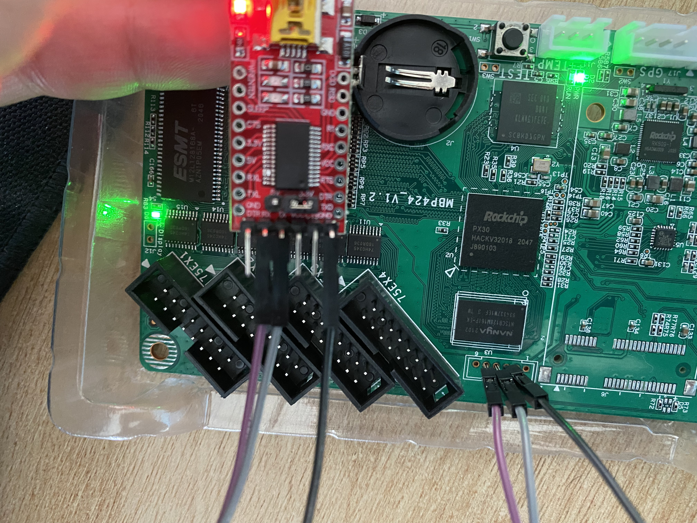

# Huidu D15

Notes and stuff around bringing up a Huidu D15 board. Mostly as a learning experience for Yocto, but
also with the potential to be the basis of a pretty capable CNC control board.

I'm using Claude Schwarz'
[Twitter thread](https://twitter.com/Claude1079/status/1513541029399519234) as
reference/inspiration.

Claude Schwarz' Github repo is [here](https://github.com/captain-amygdala/huidu-hd-d16).

## References

- <https://wiki.t-firefly.com/en/Core-PX30-JD4/getting_started.html>
- <https://github.com/captain-amygdala/huidu-hd-d16>

## Serial

- "CoolTerm" seems to be an alright serial terminal for Windows.
  - Just use PuTTY
- 115200 baud works for me with default software, although
  [apparently](https://twitter.com/Claude1079/status/1512693171305779202) 1.5MBaud (1500000) is
  default for Rockchips.
- Connections:

  

- U-Boot does indeed use 1.5MBaud

## Getting into the bootloader and changing the root password

- The serial console will start at 1.5Mbaud (default for Rockchip I think), then be reconfigured to
  115200 Baud.
- At this point, HOLD Ctrl + C as per the prompt, and now we have a uboot console.
  - Don't mash; the boot delay is zero, so mashing will likely not work but holding will.
- `env print` is useful
- A more complex solution for setting `init`:
  <https://community.toradex.com/t/passing-bootarg-init-bin-bash-to-u-boot/11141>
- However this seems to work fine, but the FS is readonly:

  ```
  => env edit bootargs
  (add the following to the end of the line:) init=/bin/sh
  => boot
  ```

- Running `mount` will give a `proc` not found error
  - Fix with `mount -t proc proc /proc`
  - Reference: https://unix.stackexchange.com/q/647916/41760
- Now remount `/` as writable: `mount -o remount,rw /`
- `passwd root`
- Power cycle the system

## Backing up the disk

- SSHd is disabled by default, but telnet isn't
  - `telnet 192.168.0.96`
- We need to sync the RTC, so ensure the battery is in the board and the board has internet access
  before boot - the NTP server will sync automatically. If we don't do this, you'll get a looping
  prompt to change your password when SSHing in.

  - Reference: <https://unix.stackexchange.com/questions/415757/password-expired-on-ssh>

- To run SSHd, generate some keys:

  - Reference: <https://michlstechblog.info/blog/linux-regenerate-sshd-host-keys/>
  - Note that some of the values change from the reference:
  - ```bash
    ssh-keygen -b 4096 -f /etc/ssh/ssh_host_rsa_key -t rsa -N ""
    ssh-keygen -b 1024 -f /etc/ssh/ssh_host_dsa_key -t dsa -N ""
    ssh-keygen -b 521 -f /etc/ssh/ssh_host_ecdsa_key -t ecdsa -N ""
    ssh-keygen -b 4096 -f /etc/ssh/ssh_host_ed25519_key -t ed25519 -N ""
    ```
  - Now run `/usr/sbin/sshd`

- Remote `dd` reference: <https://unix.stackexchange.com/a/132800/41760>
- `ssh root@192.168.0.27 "dd if=/dev/mmcblk0 | gzip -1 -" | dd of=huidu-d15.gz`
- Or to a flash drive locally: `dd if=/dev/mmcblk0 bs=64 | gzip -1 > /root/usb_dev/huidu-d15.gz`
  - Very slow, CPU bound by `gzip`.

## U-Boot notes

- Uses the `px30-evb` board which is nice
- Seems to be running Android?

  ```
  => boot
  ca head not found
  ANDROID: reboot reason: "(none)"
  Booting kernel at 0x00280000 with fdt at 1f00000...


  ## Booting Android Image at 0x0027f800 ...
  Kernel load addr 0x00280000 size 14641 KiB
  ## Flattened Device Tree blob at 01f00000
    Booting using the fdt blob at 0x1f00000
    XIP Kernel Image ... OK
    Loading Device Tree to 0000000001d4f000, end 0000000001d67ffe ... OK
  Adding bank: 0x00200000 - 0x10000000 (size: 0x0fe00000)

  Starting kernel ...
  ```

Normal startup output

```
U-Boot 2017.09-gcfe92bd-dirty (Jul 10 2019 - 14:28:45 +0800)

Model: Rockchip PX30 EVB
DRAM:  254 MiB
Relocation Offset is: 0db75000
Using default environment

dwmmc@ff370000: 1, dwmmc@ff390000: 0
Card did not respond to voltage select!
mmc_init: -95, time 9
switch to partitions #0, OK
mmc0(part 0) is current device
Bootdev: mmc 0
PartType: EFI
boot mode: None
Load FDT from boot part
DTB: rk-kernel.dtb
I2c speed: 100000Hz
PMIC:  RK8090 (on=0x69, off=0x00)
vdd_logic 1100000 uV
vdd_arm 1100000 uV
DVFS: Get dvfs device failed, ret=-19
Warn: can't find connect driver
Failed to found available display route
Warn: can't find connect driver
Failed to found available display route
In:    serial
Out:   serial
Err:   serial
Model: Rockchip linux PX30 evb ddr3 board
CLK:
apll 600000 KHz
dpll 664000 KHz
cpll 24000 KHz
npll 1188000 KHz
gpll 1200000 KHz
aclk_bus 200000 KHz
hclk_bus 150000 KHz
pclk_bus 100000 KHz
aclk_peri 200000 KHz
hclk_peri 150000 KHz
pclk_pmu 100000 KHz
DVFS: Get dvfs device failed, ret=-19
Hit key to stop autoboot('CTRL+C'):  0
```

## Links and stuff

- Porting to a new platform
  <https://elinux.org/images/2/2a/Schulz-how-to-support-new-board-u-boot-linux.pdf>
- Bitbake docs are pretty good
  <https://docs.yoctoproject.org/bitbake/bitbake-user-manual/bitbake-user-manual-intro.html#concepts>
- This guide looks nice as well
  <https://a4z.gitlab.io/docs/BitBake/guide.html#_adding_an_additional_layer>
- Need to build ARM Trusted Firmware
  <https://github.com/u-boot/u-boot/blob/master/doc/board/rockchip/rockchip.rst#tf-a>

  - More here <https://opensource.rock-chips.com/wiki_ATF>

  ```bash
  apt install gcc-aarch64-linux-gnu swig

  # ARM Trusted Firmware (ATF)
  git clone --depth 1 https://github.com/ARM-software/arm-trusted-firmware.git
  cd arm-trusted-firmware
  make realclean
  make CROSS_COMPILE=aarch64-linux-gnu- PLAT=px30

  # Uboot
  export BL31=../arm-trusted-firmware/build/px30/release/bl31/bl31.elf
  make evb-px30_defconfig
  make CROSS_COMPILE=aarch64-linux-gnu-
  ```
